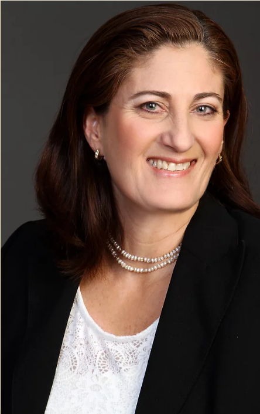

## Iris BenDavid-Hadar

**Associate Professor, Faculty of Education, Bar-Ilan University**

### Why my research matters

Where money goes in a school system shapes who gets a fair shot. My work asks how education budgets and funding formulae can be designed to both **improve outcomes** and **narrow achievement gaps** — not treat those as a trade-off. That question has taken me from a PhD dissertation on Israel's achievement gap to advising Israel's Ministry of Education on its national funding formula, testifying before the Knesset Education Committee, and reviewing UNESCO's equity-in-financing profiles for Israel.

### Academic bio

I am an Associate Professor in the Faculty of Education at Bar-Ilan University. I hold a PhD from Bar-Ilan University (2008, supervised by Prof. Adrian Ziderman), an MA and BA from Tel Aviv University, and completed a post-doc at Stanford University's School of Education (2009, hosted by Prof. Martin Carnoy). I have held visiting scholar positions at Columbia University (2015) and University College London (2023).

Over four theoretical phases, my research has developed: a composite, improvement-based method of resource allocation to schools; a framework integrating social justice theory with public finance; an account of education finance at the global level linking state competitiveness and social cohesiveness; and, most recently, the **Middle-Line Model** — a framework for escaping the traditional trade-off between competitiveness and cohesion in education finance policy. This work has been presented at venues including a US investment summit hosted by the Obama administration and, as keynote, at China's Belt and Road Initiative higher education forum.

### Research groups

My work sits at the intersection of state **competitiveness** and social **cohesiveness**, organized into three research groups:

- **[STAC — State Competitiveness](stac.html)**: international comparative research using large-scale secondary data (PIAAC, TALIS, PISA)
- **[LEAD — Learning for Strategic Development](lead.html)**: education finance policy — resource allocation mechanisms, funding formulae, and equity analysis
- **[EDS — Equity, Diversity, and Social Justice](lab.html)**: national-level policy research on inclusion, minorities, and equity of opportunity

I founded and head all three.

I have published over 40 peer-reviewed journal articles, 19 book chapters, and two edited books, including *[Education Finance, Equality and Equity](https://link.springer.com/book/10.1007/978-3-319-90388-0)* (Springer, 2018). [See my full list of papers →](papers.html)

### Contact & links

**Email:**



**Affiliation:** Faculty of Education, Bar-Ilan University, Ramat Gan, Israel

- [Bar-Ilan faculty page](https://education.biu.ac.il/en/node/344)
- [Bar-Ilan CRIS profile](https://cris.biu.ac.il/en/persons/iris-bendavid-hadar/)
- [Google Scholar](https://scholar.google.com/citations?user=zO4doM0AAAAJ&hl=en)
- [ORCID: 0000-0002-7533-4422](https://orcid.org/0000-0002-7533-4422)
- [ResearchGate](https://www.researchgate.net/profile/Iris-Bendavid-Hadar-2)
