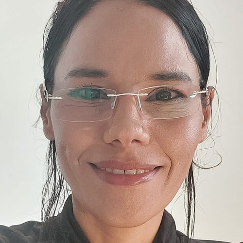
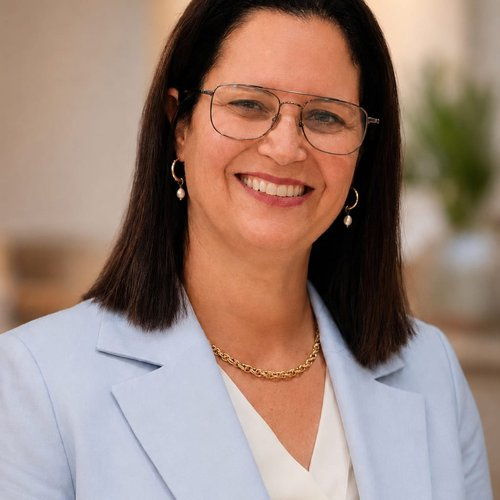
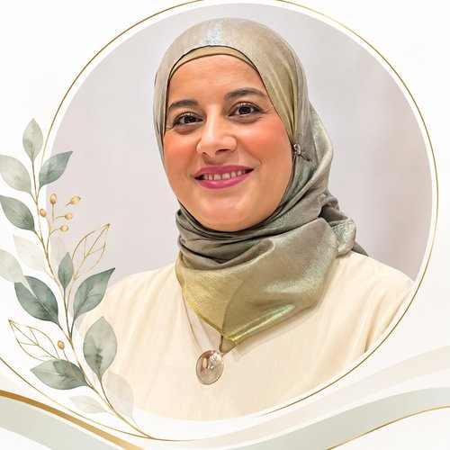
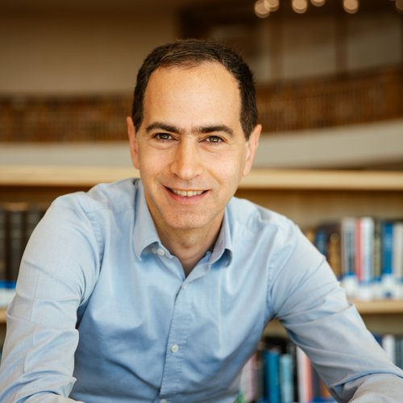
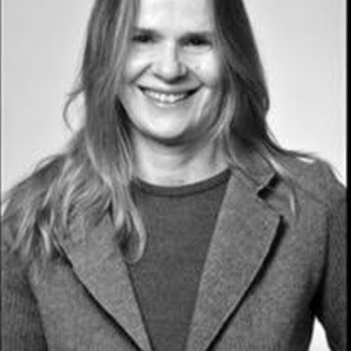

# Research Areas

Three research groups, bridging state competitiveness and social cohesiveness through education finance policy

Jump to: [Competitiveness](#competitiveness) &middot; [Education Finance Policy](#education-finance-policy) &middot; [Cohesiveness](#cohesiveness)

## Competitiveness

### STAC Research Group

Faculty of Education, Bar-Ilan University

STAC is my research group on state competitiveness — one of three groups I lead, alongside [Education Finance Policy](#education-finance-policy) ([LEAD](lead.html)) and [Cohesiveness](#cohesiveness) (equity, diversity and social justice). STAC sits at the competitiveness end of that spectrum, using international comparative research, large-scale secondary data analysis, and panel data (PIAAC, TALIS, PISA) to study how education systems build the human capital that drives state competitiveness.

#### Current work includes

- Teachers as a key driver of state competitiveness: salary, self-efficacy, and satisfaction — a comparative study using TALIS 2018
- Problem-solving skills in technology-rich environments among Israeli higher-education graduates — evidence from PIAAC
- Financial and physical resources and PISA performance: an international comparative view
- Does university attendance impact students' political tolerance and open-mindedness? The atypical case of Israel
- Does nonformal education matter? An international comparative study on nonformal education and immigrant competencies
- Does school choice affect migrant and native students similarly? Cross-country results from PISA and PIAAC data fusion
{: .card-grid}

#### Current group members

- **Yael Hoter-Hermony** — TALIS international comparative research — [thesis record →](https://education.biu.ac.il/en/node/11528)
- **Amos Polishku** — PIAAC international comparative research — [thesis record →](https://education.biu.ac.il/en/node/11692)
- **Mor Zahavi** — PIAAC international comparative research
- **Michal Unger Madar** — Creativity and social competence — [thesis record →](https://education.biu.ac.il/en/node/10033)
- **Amor Amosi-Nissan** — Periphery — [thesis record →](https://education.biu.ac.il/en/node/11122)
{: .card-grid}

---

## Education Finance Policy

### LEAD Research Group

This is my core research area: how resources are allocated to schools — and what that means for both improvement and equity in educational outcomes. My applied research group working on this, **[LEAD](lead.html)**, sits at the bridge between [Competitiveness](#competitiveness) (STAC) and [Cohesiveness](#cohesiveness) (EDS).

#### Key concepts in my work

- **Redistribution & allocation mechanisms** — resource allocation mechanisms and funding formulae, analyzed through networks and causal data-science models
- **EGini & Lorenz curves** — Gini-based indices I developed to measure equity in educational *outcomes*, not just inputs
- **IEAD (Improvement in Educational Achievement Distribution)** — reconceptualizing the relationship between level of performance and achievement gaps, so that policy doesn't have to trade off improvement against equity
- **EEO (Equality of Educational Opportunity)** — equity in inputs (central vs. local funding), horizontal equity, vertical equity, fiscal neutrality, and adequacy
{: .card-grid}

The central question I keep returning to: **can we finance education for improvement** — designing allocation mechanisms that raise outcomes *and* narrow gaps, rather than treating the two as a trade-off?

[See LEAD, my research group and the ISF-funded international workshop built on this work →](lead.html)

#### Key papers

*(Full publication list, with APA citations, on the [Papers](papers.html) page.)*

- Gilead, T., & BenDavid-Hadar, I. (2025). [Educational justice and formula funding: A complex adaptive systems perspective](https://doi.org/10.1080/00131857.2025.2494584). *Educational Philosophy and Theory, 57*(12), 1078-1089.
- Meoded, R., & BenDavid-Hadar, I. (2025). [Fiscal decentralization of education: A social network analysis of values underlying local decision-making processes](https://doi.org/10.1016/j.ijedudev.2025.103444). *International Journal of Educational Development, 119*, 103444.
- Meoded, R., & BenDavid-Hadar, I. (2025). [Does fiscal decentralization in education funding affect equity?](https://doi.org/10.1177/0160323X251339424) *State and Local Government Review*.
- Betser-Nahum, Y., & BenDavid-Hadar, I. (2025). [The municipalities' efficiency in Israel: The case of the provision of educational services](https://doi.org/10.1016/j.ijedudev.2025.103370). *International Journal of Educational Development, 117*, 103370.
- BenDavid-Hadar, I. (2023). [Resource allocation mechanism to education and funding formula in Israel](https://meyda.education.gov.il/files/LishcatMadaan/MadadTipuach/review-bendavid-hadar.pdf). Policy white paper for the Chief Scientist of the Israeli Ministry of Education. (Hebrew)
- Dadon-Golan, Z., BenDavid-Hadar, I., & Klein, J. (2019). [Revisiting educational (in)equity: Measuring educational Gini coefficients for Israeli high schools during the years 2001–2011](https://doi.org/10.1016/j.ijedudev.2019.102091). *International Journal of Educational Development, 70*, 102091. — the EGini index.
- Dadon-Golan, Z., BenDavid-Hadar, I., & Klein, J. (2019). [Equity in education: the Israeli case](https://doi.org/10.1108/ijem-09-2018-0291). *International Journal of Educational Management, 33*(7), 1670–1685.
- BenDavid-Hadar, I. (2018). [Funding education: Developing a method of allocation for improvement](https://doi.org/10.1108/ijem-07-2016-0161). *International Journal of Educational Management, 32*(1), 2–26.
- BenDavid-Hadar, I., Case, S., & Smith, R. (2018). [School funding formulae: Designed to create a learning society?](https://doi.org/10.1080/03057925.2017.1323625) *Compare: A Journal of Comparative and International Education, 48*(4), 553–570.
- BenDavid-Hadar, I., & Duani, S. (2018). [From equitable funding to equality of educational opportunity: The Israeli case](https://doi.org/10.1353/jef.2018.a707919). *Journal of Education Finance, 43*(4), 360–380.
- Gilead, T., & BenDavid-Hadar, I. (2017). [Employing needs-based funding formulae — some unavoidable tradeoffs](https://doi.org/10.1108/ijem-01-2017-0008). *International Journal of Educational Management, 31*(7), 1092–1102.
- BenDavid-Hadar, I. (2016). [School finance policy and social justice](https://doi.org/10.1016/j.ijedudev.2015.10.003). *International Journal of Educational Development, 46*, 166–174.
- BenDavid-Hadar, I. (2014). [Education, cognitive development, and poverty: Implications for school finance policy](https://doi.org/10.1353/jef.2014.a577211). *Journal of Education Finance, 40*(2), 131–155.
- BenDavid-Hadar, I. (2014). [Analyzing school finance policy: Beyond a quantitative approach](https://doi.org/10.1080/01900692.2013.831101). *International Journal of Public Administration, 37*(5), 271–280.
- BenDavid-Hadar, I. (2013). Is it really fair? A critical analysis of Israel's school finance policy. *International Journal of Educational Administration, 5*(1), 63–79.
- BenDavid-Hadar, I., & Ziderman, A. (2011). [A new model for equitable and efficient resource allocation to schools: The Israeli case](https://doi.org/10.1080/09645291003726467). *Education Economics, 19*(4), 341–362.

---

## Cohesiveness

### EDS Research Lab

**Equity, Diversity, and Social Justice**
Faculty of Education, Bar-Ilan University · Founded 2010

The EDS Lab is one of three research groups I lead — alongside [Competitiveness](#competitiveness) (STAC) and [Education Finance Policy](#education-finance-policy) (LEAD) — sitting at the cohesiveness end of that spectrum. EDS studies national-level policy questions using mixed methods: how education systems can advance equity, diversity, and social justice across special needs, minority, ultra-Orthodox, immigrant, and periphery populations.

One active initiative within the lab is our **[Cost-Effectiveness Analysis in Education research group](https://cea-ed-up5nhpz.gamma.site/)**, which develops and applies CEA methods to Israeli education programs.

#### Principal Investigator

**Prof. Iris BenDavid-Hadar** — Founder and Head. [Bio →](bio.html)

#### Meet the group

*In their own words.*

<ul class="people-grid">
<li><strong>Dr. Karen Sauer</strong>Post-doctoral researcher, LEAD
I am a Post Doctoral researcher at Bar-Ilan University. My research focuses on education governance and fiscal policy, examining how institutional reforms shape student outcomes. I am particularly interested in how the transition from decentralized to centralized education systems affects equity across regions, and in understanding the role of public spending, especially teacher compensation, in improving learning outcomes. My work uses panel-data econometric methods to analyze Chile's SLEP education reform.
</li>
<li><strong>Michal Tzadoky-Dzhurinsky</strong>PhD student, EDS
I am Michal Tzadoky-Dzhurinsky, a PhD student in Education at Bar-Ilan University. My research focuses on educational inequality and the values that shape education policy. I examine how declared and implicit values influence policies designed to reduce educational gaps in Israel, from their formulation to implementation and evaluation. Using policy analysis, interviews, and semantic network analysis, I aim to contribute to more equitable and evidence-informed education policy.
</li>
<li><strong>Yifat Betser-Nahum</strong>LEAD group member
I am the National Lead for Clinical Practice in Teacher Education at Israel's Ministry of Education. My research focuses on economic efficiency in education systems. In my published study, I examined the efficiency of Israeli local authorities in providing educational services. I am also interested in professional development and innovation in education, particularly in understanding how policy, organizational processes, and resource allocation can improve educational systems and outcomes.
</li>
<li><strong>Fatina Bader Sarsoor</strong>PhD student, EDS
I am a PhD student in Education at Bar-Ilan University. My research focuses on academic resilience, educational inequality, and reading literacy, with a particular interest in international large-scale assessments such as PIRLS. I explore how individual and school-level factors shape academic resilience across countries and over time. My research aims to deepen our understanding of the conditions that foster educational resilience and equity.
</li>
<li><strong>Dr. Roi Arjeh Wolf</strong>PhD alumnus, 2024
I am a lecturer in education at Orot Israel College. My research focuses on the political dynamics shaping the allocation of educational resources. I am particularly interested in how political actors influence education budgets and funding priorities. My work examines changes to education funding after the state budget has been approved, using in-depth interviews with key political actors and analysis of parliamentary Finance Committee records.
</li>
<li><strong>Dr. Orit Krubiner</strong>PhD alumna, 2025
I hold a PhD in Education from Bar-Ilan University. My research focuses on education policy, specialized public schools, and parental choice in Israel. I am particularly interested in how market-oriented policies and parental choice shape public education systems. My doctoral research examined four decades of policy development in Israeli specialized schools, exploring the relationships between government policy, local authorities, parental involvement, and educational equity.
</li>
</ul>

#### Current projects

- **Yaara Shilo** — Early childhood education policy
- **Fatina Bader Sarsoor** — Minority ICT4D (empowering underprivileged minority students in science education)
- **Sharon Malki-Levy** — Language policy and immigration
- **Orit Krubiner** — Specialized schools and quasi-market policy
- **Or May-Yazdi** — Financial education for the Ultra-Orthodox sector
- **Yael Leby** — Ultra-Orthodox integration in higher education
- **Uri Even** — Educational leadership
- **Reut Tsadkani** — Improvement and incentives
{: .card-grid}

#### All current & former advisees

*(across all three research groups)*

##### Current PhD students

- **Sami Atar** *(with Prof. Joseph Klein)* — Supplemental resource allocation and educational achievement distribution: local authorities in Israel
- **Fatina Bader Sarsoor** — Academic resilience and Arabic language literacy (PIRLS)
- **Michal Tzadoky-Dzhurinsky** — Equity in education policy: the Israeli case
{: .card-grid}

##### Current MA students

- **Eden Gannam** — The GEFEN reform through the lens of quasi-market theory
- **Adi Zarubi** — Teachers' salary, class size & investment in education and PISA achievements
- **Michal Rinuss** — AI in early-childhood leadership: productivity, self-efficacy, stress, burnout
- **Zvia Nadav** — Teacher pay, workload, and retention in Israel
- **Yonathan Cohen** *(with Prof. Gross)* — Student satisfaction, institutional factors, and alumni loyalty
- **Yafit Gorman** — The education finance of local authorities: a policy analysis
- **Rotem Shemesh** — Learning mathematics: an international comparative analysis
- **Hani Mihawi** — Equity in resource allocation, crisis management, and student resilience
{: .card-grid}

##### Current post-doc

- Dr. Karen Sauer (2022–present)

##### PhD alumni

<ul class="thesis-list">
<li>2025
Dr. Ruth Meoded

Equity in School Finance: The Local Authorities Case in Israel
</li>
<li>2024
Dr. Miri Wolf <small>(with Prof. Bracha Kramarski)</small>

Cultivating Teaching Beliefs and Practices for Knowledge-Constructing Metacognitive Mathematical Discourse in the Classroom Among Pre-/In-Service Teachers in a Theory-Based Training Environment That Includes Interactive Technology

<a href="https://education.biu.ac.il/en/node/12269">Thesis record →</a>
</li>
<li>2024
Dr. Yael Leby <small>(with Dr. Shira Iluz)</small>

Integrating the Ultra-Orthodox into Higher Education in Israel: From Examining Policy to Examining the Relationships Between the Need for Tuition Financing, Motives for Higher-Education Enrollment, and Individual Choice of Discipline

<a href="https://education.biu.ac.il/en/node/12443">Thesis record →</a>
</li>
<li>2024
Dr. Sharon Malki-Levy <small>(with Prof. Carmit Altman)</small>

Linguistic Inequity: A Policy Study from International, Local, and School Perspectives

<a href="https://education.biu.ac.il/en/node/12638">Thesis record →</a>
</li>
<li>2024
Dr. Orit Krubiner

Specialized Public Schools in Israel: A Longitudinal Policy Research over the Past Four Decades — The Case of Parental Choice

<a href="https://education.biu.ac.il/en/node/12508">Thesis record →</a>
</li>
<li>2023
Dr. Roi Arjeh Wolf <small>(with Prof. Joseph Klein)</small>

Between Political Climate and Budgetary Decision-Making Processes: The Case of the Changes in the Education Budget in Israel

<a href="https://education.biu.ac.il/en/node/11765">Thesis record →</a>
</li>
<li>2023
Dr. Yaara Shilo

Vision versus Reality: Early Childhood Education Policy in Israel in the Last Decades

<a href="https://education.biu.ac.il/en/node/12045">Thesis record →</a>
</li>
<li>2022
Dr. Asael Sharir <small>(with Prof. Joseph Klein)</small>

Developing an Evaluation Model for Education for Values in High Schools in the National State Education System in Israel

<a href="https://education.biu.ac.il/en/node/11782">Thesis record →</a>
</li>
<li>2021
Dr. Amor Amosi-Nissan

Policy for Promoting Excellence in the Periphery in Israel: Costs and Effectiveness Analysis of the National "Mezuyanegev" Program in Eilat

<a href="https://education.biu.ac.il/en/node/11122">Thesis record →</a>
</li>
<li>2020
Dr. Mor Zehavi

Choice and Efficiency in Education: New Perspective on the Tiebout Model
</li>
<li>2016
Dr. Zehorit Dadon-Golan

Measuring Education Inequality in Israel: New Indicators

<a href="https://education.biu.ac.il/files/education/shared/dadon-golanzehorit_.pdf">Full dissertation (PDF) →</a>
</li>
</ul>

*(A public dissertation record isn't yet available online for every 2024–2025 graduate — Bar-Ilan's repository typically has an embargo period before full text is deposited. Get in touch for a copy.)*

##### MA alumni

<ul class="thesis-list">
<li>2025
Lidor Edri

Inclusion of Children with Special Needs in Elementary Schools in Israel: Perspectives on Parental Involvement, Budgeting, and Educational Policy

<a href="https://education.biu.ac.il/en/node/12721">Thesis record →</a>
</li>
<li>2024
Yifat Betser-Nahum

Efficiency in Local Educational Funding: A Data Envelopment Analysis of Municipal Allocation

<a href="https://education.biu.ac.il/en/node/12268">Thesis record →</a>
</li>
<li>2024
Liraz Gedri

Relationships Among (Altruistic) Leadership, Teacher Satisfaction, and School Effectiveness

<a href="https://education.biu.ac.il/en/node/12502">Thesis record →</a>
</li>
<li>2022
Amos Polishku

Does Nonformal Education Matter? An International Comparative Study on the Relationships Between Nonformal Education and Competencies Among Natives and Immigrants

<a href="https://education.biu.ac.il/en/node/11692">Thesis record →</a>
</li>
<li>2022
Yael Hoter-Hermony

The Relationships Among Teacher Quality, Teacher Satisfaction, Investment in Education, and PISA Performance: An International Comparative View

<a href="https://education.biu.ac.il/en/node/11528">Thesis record →</a>
</li>
<li>2022
Reut Tsadkani

School Effectiveness in Israel: Systemic and Intra-School Perspectives

<a href="https://education.biu.ac.il/en/node/11386">Thesis record →</a>
</li>
<li>2020
Ruth Meoded

Education Finance Policy of Culturally Diverse Societies: Equity Analyses of School Finance Policy in Israeli Ultra-Orthodox Primary Education

<a href="https://education.biu.ac.il/en/node/10553">Thesis record →</a>
</li>
<li>2020
Amin ElGamal

Relationships Among Parental Choice, Satisfaction, Involvement, and Expectations, and School Efficiency: The Case of Primary Schools for Arabic-Speaking Students in Israel

<a href="https://education.biu.ac.il/en/node/10542">Thesis record →</a>
</li>
<li>2020
Roslyn Stentner

Principals' and Teachers' Perceptions of the Principal's Role in Teachers' Professional Development Toward 21st-Century Competencies

<a href="https://education.biu.ac.il/en/node/10645">Thesis record →</a>
</li>
<li>2019
Fatina Bader Sarsoor

Effectiveness and Cost-Effectiveness of Integrating ICT in Fifth-Grade Science Classes in Arabic-Speaking Schools in Israel

<a href="https://education.biu.ac.il/en/node/10262">Thesis record →</a>
</li>
<li>2019
Orit Krubiner

Specialized Schools in Israel: A Longitudinal Policy Research over the Past Three Decades

<a href="https://education.biu.ac.il/en/node/10351">Thesis record →</a>
</li>
<li>2018
Yaniv Hadad

Relationships Between Financial Education and the Consumption Culture of Young Children

<a href="https://education.biu.ac.il/en/node/10346">Thesis record →</a>
</li>
<li>2018
Michal Madar-Ungar

The Relationship Among Type of Education, Creative Thinking, and Social Competence of Children: A Cost-Effectiveness Analysis of Homeschooling in Israel

<a href="https://education.biu.ac.il/en/node/10033">Thesis record →</a>
</li>
<li>2017
Or May-Yazdi

The Relationship Among Economic Well-Being, Academic Education, and Financial Literacy: The Case of the Israeli Ultra-Orthodox Sector

<a href="https://education.biu.ac.il/en/node/9338">Thesis record →</a>
</li>
<li>2017
Idit Chalfon

The Relationships Between Parental Involvement, School Principals' Management Style, and Mathematics Achievement Among Students in Primary Schools Specializing in Behavioral Disorders

<a href="https://education.biu.ac.il/en/node/9524">Thesis record →</a>
</li>
<li>2017
Roi Arjeh Wolf
</li>
<li>2016
Sigal Duani

From Equitable Funding to Equality of Educational Opportunity: The Case of Israeli Primary Schools

<a href="https://education.biu.ac.il/en/node/8744">Thesis record →</a>
</li>
<li>2016
Uri Even

The Effects of Management Style and School Climate on Mathematics Achievement in Special-Education Schools Specializing in Conduct Disorders

<a href="https://education.biu.ac.il/en/node/8464">Thesis record →</a>
</li>
<li>2014
Idit Levy

The Integration Policy of Special-Needs Children in Regular Schools: A Comparative Policy Research
</li>
<li>2014
Noam Sharaby

Differences in Mathematics Achievement on Matriculation Examinations Based on Background Variables of Younger Students Identified as Gifted in Mathematics

<a href="https://cris.biu.ac.il/en/studentTheses/differences-in-mathematic-achievements-on-matriculation-exams-bas/">Thesis record →</a>
</li>
<li>2013
Nehama Zilberberg

A Growth Model for Evaluating Achievement in Mathematics by Measuring School Added Value Through Readiness, Participation, Self-Efficacy, Additional Reinforcement Hours, and Student Background Variables

<a href="https://cris.biu.ac.il/en/studentTheses/a-growth-model-for-evaluation-achievements-in-math-by-measuring-t/">Thesis record →</a>
</li>
<li>2012
Yuval Oz <small>(with Prof. Deborah Court)</small>

How the Democratic School "Nitzan" Tries to Minimize Social Disparities Among Disadvantaged Students: A Case Study

<a href="https://cris.biu.ac.il/en/studentTheses/how-the-democratic-school-nitzan-tries-to-mimimize-social-dispari/">Thesis record →</a>
</li>
</ul>

*(20 of 22 MA theses have a public record; the rest aren't indexed online — most likely too recent or predate digital deposit requirements.)*

##### Post-doc alumni

Dr. Zehorit Dadon-Golan (2017–2019) · Dr. Mowafaq Qadach (2018–2020)

#### In the media

- **Yaara Shilo** — early childhood education policy; [personal site](https://www.yaarashilo.co.il/) · media appearances: [1](https://youtu.be/X_mY6XjjB9A) · [2](https://www.youtube.com/watch?v=S3pAminLNzI) · [3](https://www.youtube.com/watch?v=LhwLuJTLERM)
- **Amor Amosi** — *It's All About the Music: Excellence in Israel's Periphery, a Cost-Effectiveness Analysis of the National "Mezuyanegev" Program in Eilat* — [thesis](https://d16aa377-43ba-4606-8083-8542b471a68e.filesusr.com/ugd/3cedee_4a3f71108e224efd899195804ffe4477.docx)

